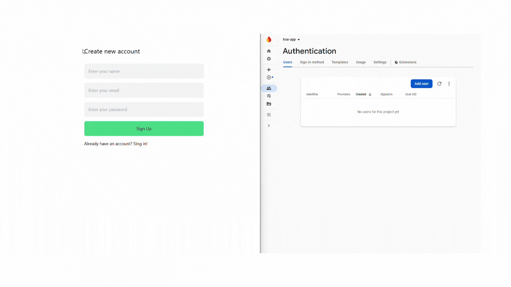

# 🛠️ React and Firebase Integration

<h3> This project is developed using React and Redux Toolkit, integrated with Firebase. Authentication is managed through Firebase for login/logout functionality, while data management is handled through Firebase's Realtime Database.</h3>

---

## 🚀 **Technologies and Libraries Used**

- 🔐 **Authentication:** User login and logout processes are controlled via Firebase Authentication.
- 📦 **Data Management** After logging in, the entered data is stored in the Firebase Realtime Database.

---

## 🚀 **Firebase Features:**

- **Authentication:** User login/logout and authentication management
- **Realtime Database:** Real-time data synchronization.
- **Cloud Storage:** File uploading and management.
- **Hosting:** Hosting the application.
- **Functions:** Serverless backend functions.
- **Push Notifications** Sending notifications via Cloud Messaging.

---

## ✅ Advantages of Using React with Firebase:

- 🔄 **Fast Development:** Reduces the need for backend development, speeding up the development process.
- 🕒 **Real-Time Data:** Real-time data synchronization with Firebase Realtime Database or Firestore.
- 🔐 **Simple Authentication:** Simplifies user management with Firebase Authentication.
- ☁️ **Serverless Backend:** No backend management is required, allowing focus on frontend development.
- 🔌 **Easy Integration** Quick integration with Firebase SDK.

---

## 🎨 Styling with Tailwind CSS:

- The project uses Tailwind CSS for utility-first styling, providing a fast and flexible way to build custom designs.

---

## 🔒 Sensitive Information Managed Securely:

- In this project, sensitive data such as the Firebase API key and other configuration details are securely managed using a .env file.

- The .env file stores the API key and other credentials as environment variables.
- These variables are accessed in the project using the process.env object, ensuring sensitive information is not exposed in the codebase.
- The .env file is added to .gitignore to prevent it from being uploaded to GitHub.

  <h2>Key Points:</h2>
  - Secure management of sensitive data.
  - .env file usage for environment variables.
  - Proper exclusion of sensitive files from version control.

  <h5>This approach ensures the project is safe while adhering to best practices in handling API keys and configuration secrets.</h5>

---

## 🚀 Live Demo 🚀

